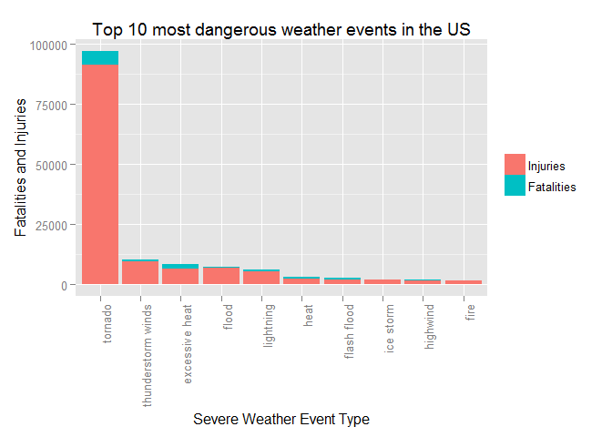
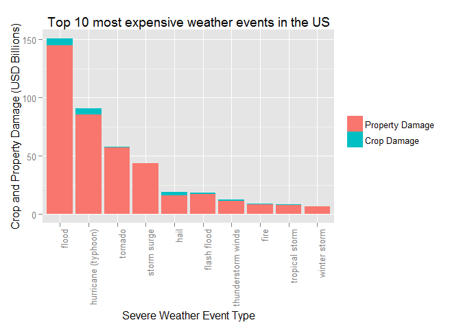

# Reproducible Research: Peer Assessment 2
##Impact analysis of severe weather events on population and the economy in the United States

##Synopsis
Storms and other severe weather events can cause both public health and economic problems for communities and municipalities. Many severe events can result in fatalities, injuries, and property damage, and preventing such outcomes to the extent possible is a key concern.

This report analyses the impact of different weather events on public health and the economy using data the U.S. National Oceanic and Atmospehric Administration's (NOAA) storm database. (Data collected from 1950 to 2011)
referece: https://d396qusza40orc.cloudfront.net/repdata%2Fpeer2_doc%2Fpd01016005curr.pdf

From the estimates of fatalities, injuries and damage to property and crops we find that <event_type/s> have the highest impact on the public and <event> causes the most economic damage.

## Data Processing
###Default settings and loading relevant libraries

```r
echo = TRUE  # Always make code visible
library(ggplot2)
```

```
## Warning: package 'ggplot2' was built under R version 3.2.1
```

```r
library(dplyr)
```

```
## Warning: package 'dplyr' was built under R version 3.2.1
```

```
## 
## Attaching package: 'dplyr'
## 
## The following objects are masked from 'package:stats':
## 
##     filter, lag
## 
## The following objects are masked from 'package:base':
## 
##     intersect, setdiff, setequal, union
```

```r
library(tm)
```

```
## Warning: package 'tm' was built under R version 3.2.1
```

```
## Loading required package: NLP
```

```
## Warning: package 'NLP' was built under R version 3.2.1
```

```
## 
## Attaching package: 'NLP'
## 
## The following object is masked from 'package:ggplot2':
## 
##     annotate
```

```r
library(reshape2)
```

```
## Warning: package 'reshape2' was built under R version 3.2.1
```

```r
options(scipen = 1) #disable scientific notation
```
  
Firstly we download the data file, unzip and read it into a data frame.
  
###Code required to load the data

```r
#Check if the file is in the working directory, if not download it.
if (!"repdata-data-StormData.csv.bz2" %in% dir("./")) {
    print("File not found! Downloading...")
    download.file("http://d396qusza40orc.cloudfront.net/repdata%2Fdata%2FStormData.csv.bz2", destfile = "repdata-data-StormData.csv.bz2")
}

#Read in the csv data, if the data exist then no need to load it again, the dataset is quite large and can take a while to load.
if (!"storm_data" %in% ls()) {
  storm_data <- read.csv(bzfile("repdata-data-StormData.csv.bz2"))
}
# Convert BGN_DATE 
storm_data$BGN_DATE<-as.Date(storm_data$BGN_DATE, format = "%m/%e/%Y %H:%M:%S")
```

Taking a quick look at the EVTYPE column we can see that there are several classifications of severe weather type, some of which are repeats or misspells. There also seem to be some summary classifications with no values

```r
#storm_data<-group_by(storm_data,EVTYPE)
#levels(storm_data$EVTYPE)
#table(storm_data$EVTYPE)
```

Digging in further we can see that the EVTYPEs called "Summary" contain no fatalities or injuries or property damage figures (assuming no negative numbers), there are also other rows without figures, so we can remove all of these.

```r
#Removing the rows without fatality injury or damage figures
storm_data<- storm_data[storm_data$FATALITIES > 0 | storm_data$INJURIES > 0 | storm_data$PROPDMG > 0 | storm_data$CROPDMG > 0, ]
```

As we will only be using data from these columns EVTYPE, FATALITIES, INJURIES, PROPDMG, PROPDMGEXP, CROPDMG, CROPDMGEXP, we can drop the rest.


```r
storm_data<-subset(storm_data,select=c(EVTYPE, FATALITIES, INJURIES, PROPDMG, PROPDMGEXP, CROPDMG, CROPDMGEXP))
```

###Consolidating the EVTYPEs

```r
storm_data$EVTYPE <- tolower(storm_data$EVTYPE) #change all to lowercase
storm_data$EVTYPE <- removePunctuation(storm_data$EVTYPE) #remove punctuation

# Looking at the top EVTYPEs
storm_data<-group_by(storm_data,EVTYPE)
arrange(summarize(storm_data, n()),desc(`n()`))
```

```
## Source: local data frame [432 x 2]
## 
##                EVTYPE   n()
## 1           tstm wind 63235
## 2   thunderstorm wind 43656
## 3             tornado 39944
## 4                hail 26130
## 5         flash flood 20968
## 6           lightning 13294
## 7  thunderstorm winds 12087
## 8               flood 10175
## 9           high wind  5522
## 10        strong wind  3372
## ..                ...   ...
```

```r
# Thunderstorm Wind (TSTM WIND) is the largest category with 63234+43655+12086 entries, there are various misspelled versions of this event type as well, we'll group them together and do the same for the other categories of EVTYPE.

#filter(summarise(storm_data,n()), grepl(".*thun.*win.*",EVTYPE))
storm_data$EVTYPE <- gsub(".*thun.*win.*", "thunderstorm winds", storm_data$EVTYPE)
#length(unique(storm_data$EVTYPE))
#filter(summarise(storm_data,n()), grepl(".*tstm.*",EVTYPE))
storm_data$EVTYPE <- gsub(".*tstm.*", "thunderstorm winds", storm_data$EVTYPE)
#length(unique(storm_data$EVTYPE))

#filter(summarise(storm_data,n()), grepl("hail",EVTYPE))
storm_data$EVTYPE <- gsub(".*hail.*", "hail", storm_data$EVTYPE)
#length(unique(storm_data$EVTYPE))

#filter(summarise(storm_data,n()), grepl(".*wind.*ill.*|.*cold.*",EVTYPE))
storm_data$EVTYPE <- gsub(".*wind.*ill.*|.*cold.*", "Cold/Windchill", storm_data$EVTYPE)
#length(unique(storm_data$EVTYPE))

#filter(summarise(storm_data,n()), grepl(".*tornado.*",EVTYPE))
storm_data$EVTYPE <- gsub(".*tornado.*", "tornado", storm_data$EVTYPE)
#length(unique(storm_data$EVTYPE))

#filter(summarise(storm_data,n()), grepl(".*flash.*",EVTYPE))
storm_data$EVTYPE <- gsub(".*flash.*", "flash flood", storm_data$EVTYPE)
#length(unique(storm_data$EVTYPE))

#filter(summarise(storm_data,n()), grepl("^flood.*",EVTYPE))
storm_data$EVTYPE <- gsub("^flood.*", "flood", storm_data$EVTYPE)
#length(unique(storm_data$EVTYPE))

#filter(summarise(storm_data,n()), grepl(".*water.*spout.*",EVTYPE))
storm_data$EVTYPE <- gsub(".*water.*spout.*", "water spout", storm_data$EVTYPE)
#length(unique(storm_data$EVTYPE))
#filter(summarise(storm_data,n()), grepl(".*ligh.*ing.*",EVTYPE))
storm_data$EVTYPE <- gsub(".*ligh.*ing.*", "lightning", storm_data$EVTYPE)
#length(unique(storm_data$EVTYPE))

#filter(summarise(storm_data,n()), grepl(".*heavy.*sno.*",EVTYPE))
storm_data$EVTYPE <- gsub(".*heavy.*sno.*", "heavy snow", storm_data$EVTYPE)
#length(unique(storm_data$EVTYPE))

#filter(summarise(storm_data,n()), grepl(".*blizz.*",EVTYPE))
storm_data$EVTYPE <- gsub(".*blizz.*", "blizzard", storm_data$EVTYPE)
#length(unique(storm_data$EVTYPE))

#filter(summarise(storm_data,n()), grepl(".*drought.*",EVTYPE))
storm_data$EVTYPE <- gsub(".*drought.*", "drought", storm_data$EVTYPE)
#length(unique(storm_data$EVTYPE))

#filter(summarise(storm_data,n()), grepl(".*fire.*",EVTYPE))
storm_data$EVTYPE <- gsub(".*fire.*", "fire", storm_data$EVTYPE)
#length(unique(storm_data$EVTYPE))

#filter(summarise(storm_data,n()), grepl(".*urban.*",EVTYPE))
#urban and/or small stream flooding should be classified as heavy rain - see 7.21 in the reference
storm_data$EVTYPE <- gsub(".*urban.*", "heavy rain", storm_data$EVTYPE)
#length(unique(storm_data$EVTYPE))

#filter(summarise(storm_data,n()), grepl(".*frost.*|.*freeze.*",EVTYPE))
storm_data$EVTYPE <- gsub(".*frost.*|.*freeze.*", "frost/freeze", storm_data$EVTYPE)
#length(unique(storm_data$EVTYPE))

#filter(summarise(storm_data,n()), grepl(".*fog.*",EVTYPE))
storm_data$EVTYPE <- gsub(".*fog.*", "fog", storm_data$EVTYPE)
#length(unique(storm_data$EVTYPE))

#filter(summarise(storm_data,n()), grepl(".*freezing rain.*",EVTYPE))
storm_data$EVTYPE <- gsub(".*freezing rain.*", "winter weather", storm_data$EVTYPE)
#length(unique(storm_data$EVTYPE))

#filter(summarise(storm_data,n()), grepl(".*sleet.*",EVTYPE))
storm_data$EVTYPE <- gsub(".*sleet.*", "sleet", storm_data$EVTYPE)
#length(unique(storm_data$EVTYPE))

#filter(summarise(storm_data,n()), grepl(".*high.*wind.*",EVTYPE))
storm_data$EVTYPE <- gsub(".*high.*wind.*","highwind", storm_data$EVTYPE)
#length(unique(storm_data$EVTYPE))

#filter(summarise(storm_data,n()), grepl(".*tropical storm.*",EVTYPE))
storm_data$EVTYPE <- gsub(".*tropical storm.*","tropical storm", storm_data$EVTYPE)
#length(unique(storm_data$EVTYPE))

#filter(summarise(storm_data,n()), grepl(".*burst.*",EVTYPE))
storm_data$EVTYPE <- gsub(".*burst.*","thunderstorm winds", storm_data$EVTYPE)
#length(unique(storm_data$EVTYPE))

#filter(summarise(storm_data,n()), grepl(".*hurr.*|.*typ.*",EVTYPE))
storm_data$EVTYPE <- gsub(".*hurr.*|.*typ.*","hurricane (typhoon)", storm_data$EVTYPE)
#length(unique(storm_data$EVTYPE))

#filter(summarise(storm_data,n()), grepl(".*heavy rain.*",EVTYPE))
storm_data$EVTYPE <- gsub(".*heavy rain.*","heavy rain", storm_data$EVTYPE)
#length(unique(storm_data$EVTYPE))

#filter(summarise(storm_data,n()), grepl("rain heavy|heavy showers|heavy precipatation|heavy mix",EVTYPE))
storm_data$EVTYPE <- gsub("rain heavy|heavy showers|heavy precipatation|heavy mix","heavy rain", storm_data$EVTYPE)
#length(unique(storm_data$EVTYPE))

#filter(summarise(storm_data,n()), grepl(".*heavy surf.*",EVTYPE))
storm_data$EVTYPE <- gsub(".*heavy surf.*","high surf", storm_data$EVTYPE)
#length(unique(storm_data$EVTYPE))

#filter(summarise(storm_data,n()), grepl(".*unseasonably warm.*|unseasonably hot",EVTYPE))
storm_data$EVTYPE <- gsub(".*unseasonably warm.*|unseasonably hot","heat", storm_data$EVTYPE)
#length(unique(storm_data$EVTYPE))

#filter(summarise(storm_data,n()), grepl(".*record warm.*|.*record heat.*|.*record high.*|high temp.*record.*",EVTYPE))
storm_data$EVTYPE <- gsub(".*record warm.*|.*record heat.*|.*record high.*|high temp.*record.*","excessive heat", storm_data$EVTYPE)
#length(unique(storm_data$EVTYPE))
```

##Converting the property and crop damage figures
Looking at the levels of the property and crop damage exponents we can see that there are several that do not follow the specification in the documentation, e.g. "-", "+", "2", "3","4","5","6","7","?" but the instances are low so we will ignore those.

```r
pde<-group_by(storm_data,PROPDMGEXP)
cde<-group_by(storm_data,CROPDMGEXP)
summarise(pde,n()) #PROPDMGEXP Levels
```

```
## Source: local data frame [16 x 2]
## 
##    PROPDMGEXP    n()
## 1              11585
## 2           -      1
## 3           +      5
## 4           0    210
## 5           2      1
## 6           3      1
## 7           4      4
## 8           5     18
## 9           6      3
## 10          7      3
## 11          B     40
## 12          h      1
## 13          H      6
## 14          K 231428
## 15          m      7
## 16          M  11320
```

```r
summarise(cde,n()) #CROPDMGEXP Levels
```

```
## Source: local data frame [8 x 2]
## 
##   CROPDMGEXP    n()
## 1            152664
## 2          ?      6
## 3          0     17
## 4          B      7
## 5          k     21
## 6          K  99932
## 7          m      1
## 8          M   1985
```

```r
# convert all unknown exponents to 0
storm_data$PROPDMGEXP<-gsub("\\-|\\+|\\?|0|2|3|4|5|6|7",0,storm_data$PROPDMGEXP)
storm_data$CROPDMGEXP<-gsub("\\-|\\+|\\?|0|2|3|4|5|6|7",0,storm_data$CROPDMGEXP)
```

Converting the PROPDMGEXP and CROPDMGEXP to the proper exponents, and adding two new columns for property and crop damage.

```r
storm_data$PROPDMGEXP<-gsub("H|h",2,storm_data$PROPDMGEXP)
storm_data$PROPDMGEXP<-gsub("K|k",3,storm_data$PROPDMGEXP)
storm_data$PROPDMGEXP<-gsub("M|m",6,storm_data$PROPDMGEXP)
storm_data$PROPDMGEXP<-gsub("B|b",9,storm_data$PROPDMGEXP)
storm_data$CROPDMGEXP<-gsub("H|h",2,storm_data$CROPDMGEXP)
storm_data$CROPDMGEXP<-gsub("K|k",3,storm_data$CROPDMGEXP)
storm_data$CROPDMGEXP<-gsub("M|m",6,storm_data$CROPDMGEXP)
storm_data$CROPDMGEXP<-gsub("B|b",9,storm_data$CROPDMGEXP)

#Convert NAs to 0
storm_data$PROPDMG<-as.numeric(storm_data$PROPDMG)
storm_data$CROPDMG<-as.numeric(storm_data$CROPDMG)
storm_data$PROPDMGEXP<-as.numeric(storm_data$PROPDMGEXP)
storm_data$CROPDMGEXP<-as.numeric(storm_data$CROPDMGEXP)
storm_data$PROPDMG[is.na(storm_data$PROPDMG)]=0
storm_data$CROPDMG[is.na(storm_data$CROPDMG)]=0
storm_data$PROPDMGEXP[is.na(storm_data$PROPDMGEXP)]=0
storm_data$CROPDMGEXP[is.na(storm_data$CROPDMGEXP)]=0

#Adding columns with actual damage figures
storm_data <- mutate(storm_data, Property_Damage = PROPDMG * 10^as.numeric(PROPDMGEXP), Crop_Damage = CROPDMG * 10^as.numeric(CROPDMGEXP))
```

#Results
##What events caused the most fatalities and injuries?
Looking at the data, tornadoes cause the most fatalities in the US followed by thunderstorm winds.


```r
fni<-arrange(summarise(group_by(storm_data,EVTYPE),Total_Injuries=sum(INJURIES),Total_Fatalities=sum(FATALITIES)),desc(Total_Injuries,Total_Fatalities))
# Looking only at the top ten results
fni<-head(fni,n=10)
fni<-melt(fni,id.vars="EVTYPE")

ggplot(fni, aes(x=reorder(EVTYPE, -value), y=value, fill=variable)) +
  geom_bar(stat="identity")+
  labs(x="Severe Weather Event Type", y="Fatalities and Injuries", title="Top 10 most dangerous weather events in the US") +
  scale_fill_discrete(name="",labels=c('Injuries','Fatalities')) +
  theme(axis.text.x = element_text(angle = 90, hjust = 1))
```

 

##What events caused the most economic damage?
Looking at the data, floods cause the most economic damage by far, followed by hurricanes/typhoons.


```r
pnc<-arrange(summarise(group_by(storm_data,EVTYPE),Total_PropertyDMG=sum(Property_Damage),Total_CropDMG=sum(Crop_Damage)),desc(Total_PropertyDMG,Total_CropDMG))

# Looking only at the top ten results
pnc<-head(pnc,n=10)
pnc<-melt(pnc,id.vars="EVTYPE")

ggplot(pnc, aes(x=reorder(EVTYPE, -value), y=value/1000000000, fill=variable)) +
  geom_bar(stat="identity")+
  labs(x="Severe Weather Event Type", y="Crop and Property Damage (USD Billions)", title="Top 10 most expensive weather events in the US") +
  scale_fill_discrete(name="",labels=c('Property Damage','Crop Damage')) +
  theme(axis.text.x = element_text(angle = 90, hjust = 1))
```

 
